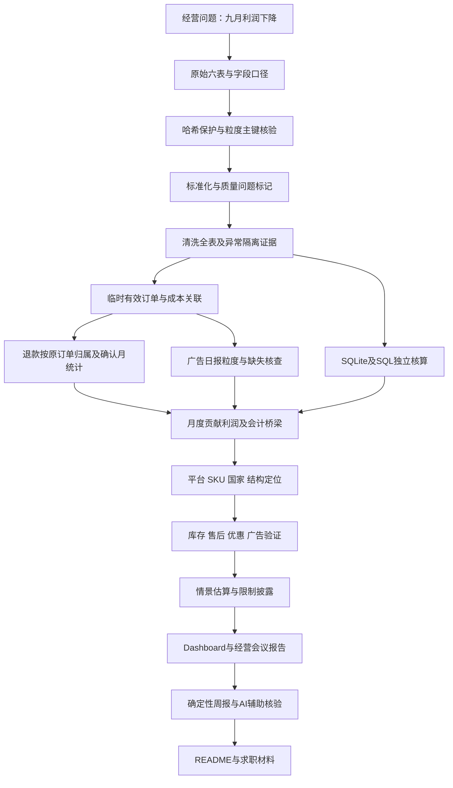

# 项目流程

**基于模拟数据的业务分析项目。**

```mermaid
flowchart TD
    A[经营问题：九月利润下降] --> B[原始六表与字段口径]
    B --> C[哈希保护与粒度主键核验]
    C --> D[标准化与质量问题标记]
    D --> E[清洗全表及异常隔离证据]
    E --> F[临时有效订单与成本关联]
    F --> G[退款按原订单归属及确认月统计]
    F --> H[广告日报粒度与缺失核查]
    G --> I[月度贡献利润及会计桥梁]
    H --> I
    I --> J[平台 SKU 国家 结构定位]
    J --> K[库存 售后 优惠 广告验证]
    K --> L[情景估算与限制披露]
    L --> M[Dashboard与经营会议报告]
    E --> N[SQLite及SQL独立核算]
    N --> I
    M --> O[确定性周报与AI辅助核验]
    O --> P[README与求职材料]
```
